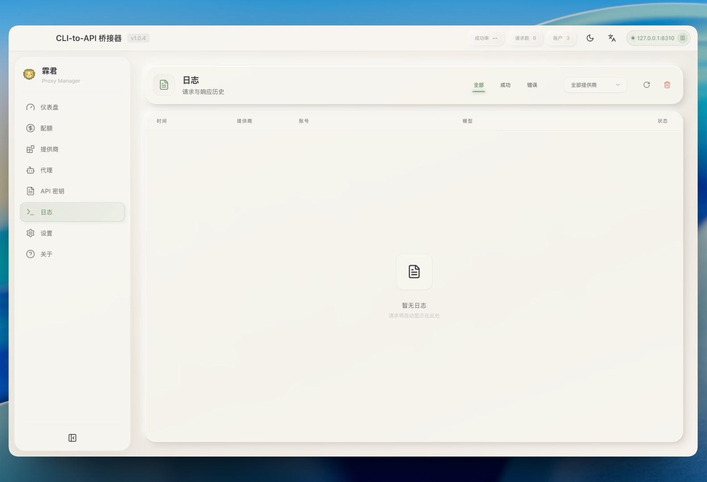

# 霖君

<p align="center">
  
</p>

<p align="center">
  <a href="https://developer.apple.com/macos/"></a>
  <a href="https://www.microsoft.com/windows/"></a>
  <a href="https://www.linux.org/"></a>
  <a href="https://www.typescriptlang.org/"></a>
  <a href="LICENSE"></a>
</p>

<p align="center">
  <strong><a href="README_CN.md">中文</a></strong>
  ·
  <strong><a href="https://linjun-site.940703.xyz">官网</a></strong>
</p>

<p align="center">
  <strong>Cross-platform AI proxy management for Claude, Gemini, Codex, Copilot, Qwen, iFlow, Kiro, and more.</strong>
</p>

<p align="center">
  LinJun is a native desktop application for managing <a href="https://github.com/router-for-me/CLIProxyAPIPlus">CLIProxyAPIPlus</a> - a local proxy server that powers your AI coding agents. It helps you manage multiple AI accounts, track quotas, and configure CLI tools in one place across <strong>macOS</strong>, <strong>Windows</strong>, and <strong>Linux</strong>.
</p>

## ✨ Features

- 🔌 **Expanded Provider Support**: Connect Claude, Gemini, Codex, Qwen, Antigravity, iFlow, GitHub Copilot, Kiro, Custom Provider, and AmpCode
- 📊 **Quota + Model Visibility**: Track account usage and open **View All Models** to browse the provider-scoped model catalog
- 🧠 **Provider-Aware Model Filtering**: Quota model list is filtered by provider context (for example Codex/Copilot/Kiro-specific views)
- ⚡ **Large Log Performance**: Virtualized log table and incremental polling keep the Logs page responsive for large datasets
- 🚀 **One-Click Agent Configuration**: Auto-detect and configure Claude Code, OpenCode, Gemini CLI, and more
- 📈 **Live Dashboard**: Monitor request traffic, token usage, and success rates
- 🔀 **Smart Routing**: Round Robin and Fill First failover strategies
- 🔑 **API Key Management**: Generate and manage keys for your local proxy
- 🖥️ **System Tray Integration**: Quick access to status from menu bar
- 🌐 **Multilingual**: English and Simplified Chinese support

## 🤖 Supported Ecosystem

### AI Providers

| Provider        | Auth Method    |
| --------------- | -------------- |
| Claude Code     | OAuth          |
| Gemini CLI      | OAuth          |
| OpenAI Codex    | OAuth          |
| Qwen Code       | OAuth          |
| Antigravity     | OAuth (Google) |
| iFlow           | OAuth          |
| GitHub Copilot  | OAuth          |
| Kiro            | OAuth          |
| Custom Provider | API Key        |
| AmpCode         | API Key        |

### Compatible CLI Agents

LinJun can automatically configure these tools to use your centralized proxy:

- Claude Code
- Codex CLI
- Gemini CLI
- OpenCode
- Amp CLI
- Droid CLI
- iFlow CLI

## 📥 Installation

### Download

Download the latest release from [GitHub Releases](https://github.com/wangdabaoqq/LinJun/releases):

| Platform              | Download                              |
| --------------------- | ------------------------------------- |
| macOS (Apple Silicon) | `LinJun-x.x.x-arm64.dmg`              |
| macOS (Intel)         | `LinJun-x.x.x-x64.dmg`                |
| Windows               | `LinJun-x.x.x-x64.exe`                |
| Linux                 | `LinJun-x.x.x-x64.AppImage` or `.deb` |

### Build from Source

**Requirements:**

- Node.js 18+
- Bun (recommended) or npm
- Git

```bash
# Clone the repository
git clone https://github.com/wangdabaoqq/LinJun.git
cd LinJun

# Install dependencies
bun install

# Download CLIProxyAPIPlus binary
bun run download:binary

# Start development server
bun dev
```

### Build for Production

```bash
bun run build:mac      # macOS (dmg, zip)
bun run build:win      # Windows (nsis)
bun run build:linux    # Linux (AppImage, deb)
bun run build:all      # All platforms
```

## 📖 Usage

### 1. Start the Server

Launch LinJun and click **Start** to initialize the local proxy server.

### 2. Connect Accounts

Go to **Providers** tab → Select a provider → Authenticate via OAuth or enter API key.

### 3. Configure Agents

Go to **Agents** tab → Select detected agent → Configure to use local proxy.

### 4. Monitor Usage

- **Dashboard**: Overall health and traffic
- **Quota**: Per-account usage breakdown and provider-scoped model catalog via **View All Models**
- **Logs**: Raw request logs for debugging

## 📸 Screenshots

| Dashboard                                    | Providers                                    |
| -------------------------------------------- | -------------------------------------------- |
|  |  |

| Quota Monitoring                     | Settings                                   |
| ------------------------------------ | ------------------------------------------ |
|  |  |

| Agents                                 | API Key                                  |
| -------------------------------------- | ---------------------------------------- |
|  |  |

| Guide                                | Logs                               |
| ------------------------------------ | ---------------------------------- |
|  |  |

## ⚙️ Settings

- **Port**: Change the proxy listening port (default: 8310)
- **Routing Strategy**: Round Robin or Fill First
- **Auto-start**: Launch proxy automatically on app startup
- **Notifications**: Toggle alerts for quota warnings

## 🏗️ Architecture

```
LinJun/
├── src/
│   ├── main/                    # Electron main process
│   │   ├── index.ts            # App entry point
│   │   ├── tray.ts             # System tray integration
│   │   ├── proxy/              # CLIProxyAPIPlus management
│   │   │   ├── manager.ts      # Process lifecycle
│   │   │   └── api.ts          # Management API client
│   │   ├── ipc/                # IPC handlers
│   │   ├── quota/              # Provider quota services
│   │   ├── logging/            # Request logging
│   │   └── utils/              # CLI detection, storage
│   ├── preload/                # Context bridge
│   └── renderer/               # React frontend
│       ├── components/         # UI components
│       ├── stores/             # Zustand state
│       └── hooks/              # Custom hooks
├── resources/                  # Static assets
└── scripts/                    # Build scripts
```

## 🔧 Tech Stack

| Component | Technology            |
| --------- | --------------------- |
| Framework | Electron 33+          |
| Frontend  | React 18 + TypeScript |
| Styling   | Tailwind CSS          |
| State     | Zustand               |
| Build     | Vite + electron-vite  |
| Packaging | electron-builder      |

## 📁 Auth File Storage

Authentication is managed through CLIProxyAPIPlus `auth-files`, not a fixed `~/.cli-proxy-api/` directory.

LinJun reads accounts from the local management API. When auth files are stored locally, they use the configured `auth-dir` from `config.yaml`; if that is not set, the default location is the app's `cli-proxy/auth` directory under Electron `userData`.

Typical auth filenames include:

- `codex-{email}-Plus.json`
- `antigravity-{email}.json`
- `kiro-{auth-method}-{id}.json`
- etc.

## ❓ FAQ

### macOS: "App is damaged and can't be opened"

Due to macOS security mechanisms, apps downloaded outside the App Store may trigger this warning. Run the following command to fix it:

```bash
sudo xattr -rd com.apple.quarantine "/Applications/霖君.app"
```

## 🤝 Contributing

1. Fork the project
2. Create a feature branch (`git checkout -b feature/amazing-feature`)
3. Commit changes (`git commit -m 'Add amazing feature'`)
4. Push to branch (`git push origin feature/amazing-feature`)
5. Open a Pull Request

## 📄 License

MIT License. See [LICENSE](LICENSE) for details.

## 🙏 Acknowledgments

- [CLIProxyAPIPlus](https://github.com/router-for-me/CLIProxyAPIPlus) - The amazing proxy server
- [Quotio](https://github.com/nguyenphutrong/quotio) - Inspiration for this project
- [Electron](https://www.electronjs.org/) - Cross-platform framework
- [Vite](https://vitejs.dev/) - Fast build tool

---

[](https://star-history.com/#wangdabaoqq/LinJun&Date)
