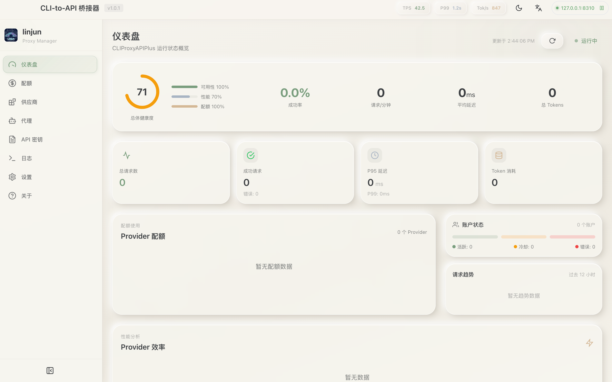
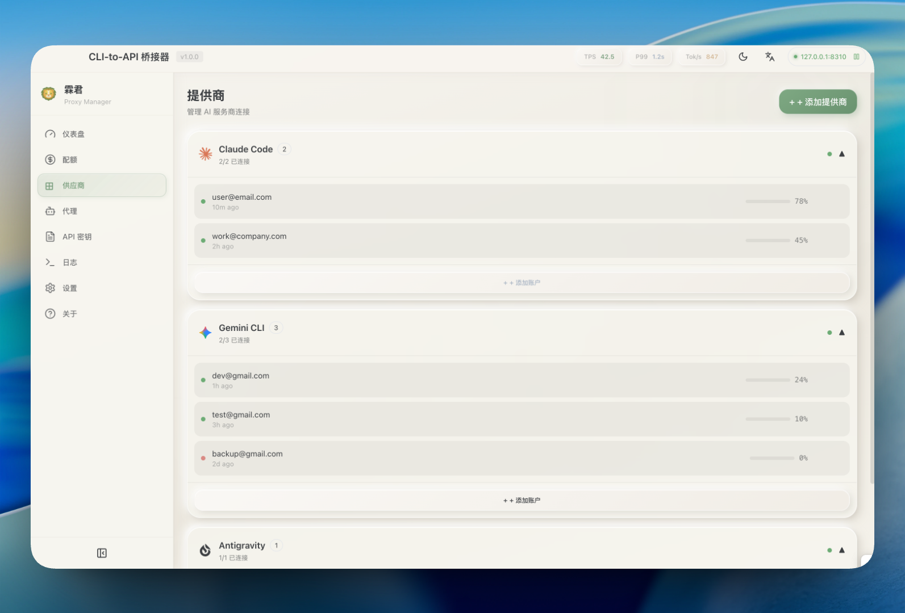
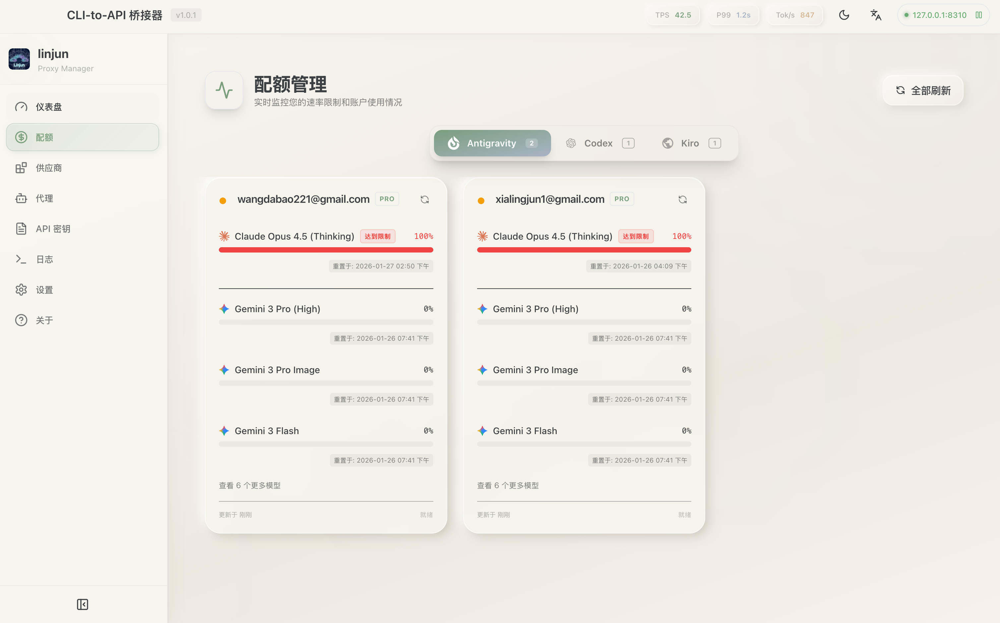
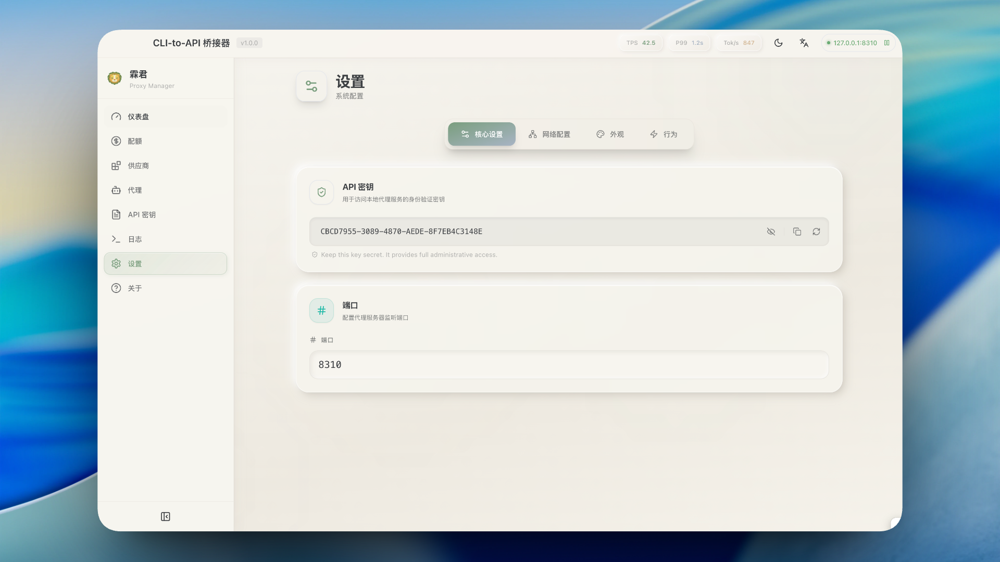
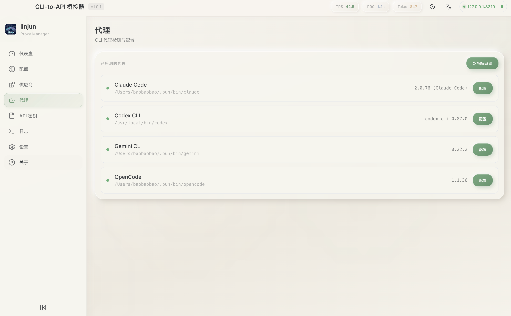
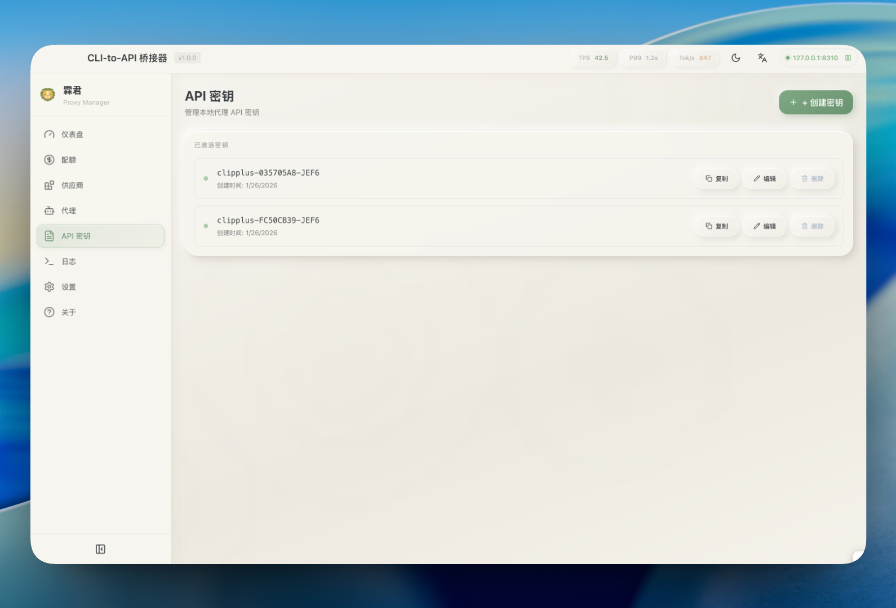

# 霖君

<p align="center">
  
</p>

<p align="center">
  <a href="https://developer.apple.com/macos/"></a>
  <a href="https://www.microsoft.com/windows/"></a>
  <a href="https://www.linux.org/"></a>
  <a href="https://www.typescriptlang.org/"></a>
  <a href="LICENSE"></a>
</p>

**[English](README.md)**

**跨平台 AI 代理管理工具，支持 Claude、Gemini、OpenAI、Qwen 等。**

霖君是一款原生桌面应用，用于管理 [CLIProxyAPIPlus](https://github.com/router-for-me/CLIProxyAPIPlus) —— 一个为 AI 编程助手提供支持的本地代理服务器。它帮助你在 **macOS**、**Windows** 和 **Linux** 上统一管理多个 AI 账户、追踪配额、配置 CLI 工具。

## ✨ 功能特性

- 🔌 **多服务商支持**：通过 OAuth 或 API Key 连接 Claude、Gemini、OpenAI Codex、Qwen、Antigravity、iFlow、Kiro、Vertex AI、GitHub Copilot 等账户
- 📊 **实时配额追踪**：自动刷新，监控每个账户的使用情况
- 🚀 **一键配置 Agent**：自动检测并配置 Claude Code、OpenCode、Gemini CLI 等工具
- 📈 **实时仪表盘**：监控请求流量、Token 使用量和成功率
- 🔀 **智能路由**：支持轮询（Round Robin）和填充优先（Fill First）故障转移策略
- 🔑 **API Key 管理**：为本地代理生成和管理密钥
- 🖥️ **系统托盘集成**：从菜单栏快速访问状态
- 🌐 **多语言支持**：支持英文和简体中文

## 🤖 支持的生态系统

### AI 服务商

| 服务商         | 认证方式       |
| -------------- | -------------- |
| Claude Code    | OAuth          |
| Gemini CLI     | OAuth          |
| OpenAI Codex   | OAuth          |
| Qwen Code      | OAuth          |
| Antigravity    | OAuth (Google) |
| iFlow          | OAuth          |
| GitHub Copilot | OAuth          |
| Kiro           | OAuth          |
| Vertex AI      | OAuth          |
| 自定义服务商   | API Key        |

### 兼容的 CLI Agent

霖君可以自动配置以下工具使用你的集中代理：

- Claude Code
- Codex CLI
- Gemini CLI
- OpenCode

## 📥 安装

### 下载安装

从 [GitHub Releases](https://github.com/wangdabaoqq/L-jun/releases) 下载最新版本：

| 平台                  | 下载文件                        |
| --------------------- | ------------------------------- |
| macOS (Apple Silicon) | `霖君-x.x.x-arm64.dmg`          |
| macOS (Intel)         | `霖君-x.x.x.dmg`                |
| Windows               | `霖君-Setup-x.x.x.exe`          |
| Linux                 | `霖君-x.x.x.AppImage` 或 `.deb` |

### 从源码构建

**环境要求：**

- Node.js 18+
- Bun（推荐）或 npm
- Git

```bash
# 克隆仓库
git clone https://github.com/wangdabaoqq/L-jun.git
cd L-jun

# 安装依赖
bun install

# 下载 CLIProxyAPIPlus 二进制文件
bun run download:binary

# 启动开发服务器
bun dev
```

### 构建生产版本

```bash
bun run build:mac      # macOS (dmg, zip)
bun run build:win      # Windows (nsis, portable)
bun run build:linux    # Linux (AppImage, deb)
bun run build:all      # 所有平台
```

## 📖 使用方法

### 1. 启动服务器

启动 霖君，点击 **Start** 初始化本地代理服务器。

### 2. 连接账户

进入 **Providers** 标签页 → 选择服务商 → 通过 OAuth 认证或输入 API Key。

### 3. 配置 Agent

进入 **Agents** 标签页 → 选择检测到的 Agent → 配置使用本地代理。

### 4. 监控使用情况

- **Dashboard**：整体健康状况和流量
- **Quota**：每个账户的使用明细
- **Logs**：原始请求日志，用于调试

## 📸 截图

| 仪表盘                                       | 服务商                                       |
| -------------------------------------------- | -------------------------------------------- |
|  |  |

| 配额监控                             | 设置                                       |
| ------------------------------------ | ------------------------------------------ |
|  |  |

| 代理配置                               | API 密钥                                 |
| -------------------------------------- | ---------------------------------------- |
|  |  |

## ⚙️ 设置选项

- **端口**：更改代理监听端口（默认：8317）
- **路由策略**：轮询（Round Robin）或填充优先（Fill First）
- **自动启动**：应用启动时自动启动代理
- **通知**：开启/关闭配额警告提醒

## 🏗️ 项目结构

```
霖君/
├── src/
│   ├── main/                    # Electron 主进程
│   │   ├── index.ts            # 应用入口
│   │   ├── tray.ts             # 系统托盘集成
│   │   ├── proxy/              # CLIProxyAPIPlus 管理
│   │   │   ├── manager.ts      # 进程生命周期
│   │   │   └── api.ts          # 管理 API 客户端
│   │   ├── ipc/                # IPC 处理器
│   │   ├── quota/              # 服务商配额服务
│   │   ├── logging/            # 请求日志
│   │   └── utils/              # CLI 检测、存储
│   ├── preload/                # 上下文桥接
│   └── renderer/               # React 前端
│       ├── components/         # UI 组件
│       ├── stores/             # Zustand 状态
│       └── hooks/              # 自定义 Hooks
├── resources/                  # 静态资源
└── scripts/                    # 构建脚本
```

## 🔧 技术栈

| 组件     | 技术                  |
| -------- | --------------------- |
| 框架     | Electron 33+          |
| 前端     | React 18 + TypeScript |
| 样式     | Tailwind CSS          |
| 状态管理 | Zustand               |
| 构建工具 | Vite + electron-vite  |
| 打包工具 | electron-builder      |

## 📁 Token 存储

认证 Token 存储在 `~/.cli-proxy-api/` 目录下的 JSON 文件中：

- `codex-{email}-Plus.json`
- `antigravity-{email}.json`
- `kiro-google-{id}.json`
- 等等

## 🤝 贡献

1. Fork 本项目
2. 创建功能分支 (`git checkout -b feature/amazing-feature`)
3. 提交更改 (`git commit -m 'Add amazing feature'`)
4. 推送到分支 (`git push origin feature/amazing-feature`)
5. 提交 Pull Request

## 📄 许可证

MIT 许可证。详见 [LICENSE](LICENSE)。

## 🙏 致谢

- [CLIProxyAPIPlus](https://github.com/router-for-me/CLIProxyAPIPlus) - 强大的代理服务器
- [Quotio](https://github.com/nguyenphutrong/quotio) - 项目灵感来源
- [Electron](https://www.electronjs.org/) - 跨平台框架
- [Vite](https://vitejs.dev/) - 快速构建工具

---

[](https://star-history.com/#wangdabaoqq/L-jun&Date)
